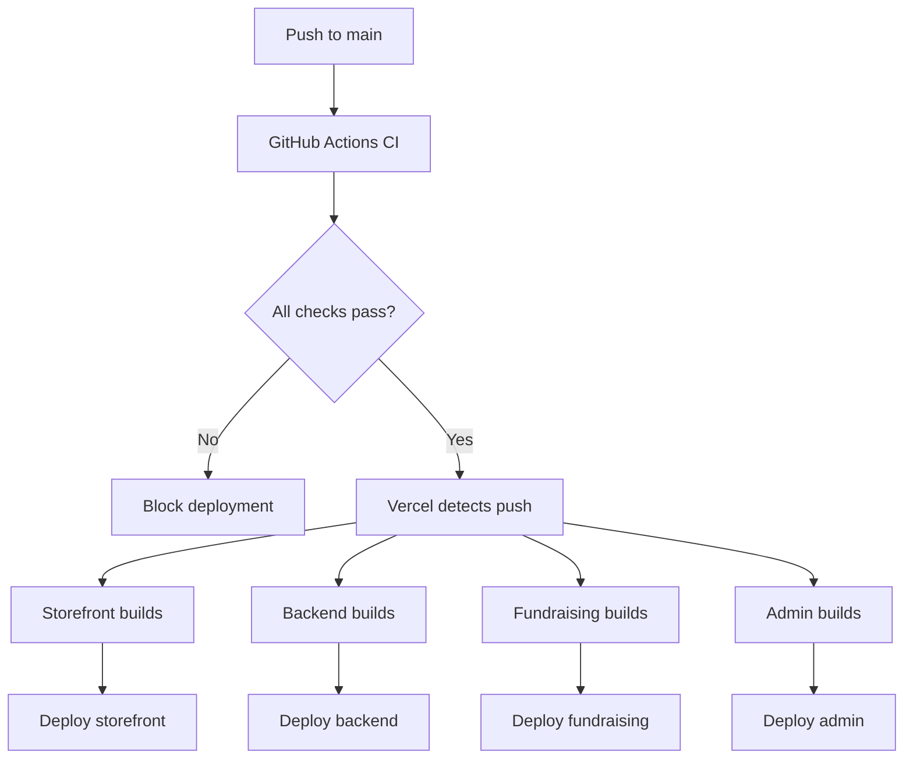

# Deployment Configuration - Unified Monorepo

This document outlines the deployment configuration for all applications in the Jose Madrid Salsa monorepo after the repository consolidation. All apps are now deployed from a single repository using Vercel's monorepo support.

**Related Documentation:**
- [Deployment Checklist](.github/DEPLOYMENT_CHECKLIST.md) - Pre-deployment verification steps
- [Migration Notes](MIGRATION_NOTES.md) - Repository consolidation context
- [Shared Code Strategy](SHARED_CODE_STRATEGY.md) - Shared package architecture

---

## Table of Contents

1. [Overview](#overview)
2. [Applications](#applications)
3. [Deployment Strategy](#deployment-strategy)
4. [Environment Variables](#environment-variables)
5. [Vercel Configuration](#vercel-configuration)
6. [CI/CD Integration](#cicd-integration)
7. [Deployment Procedures](#deployment-procedures)
8. [Monitoring & Rollback](#monitoring--rollback)

---

## Overview

The monorepo contains four deployable applications, each with its own deployment boundary and configuration:

| Application | Port | Purpose | Deployment Type |
|-------------|------|---------|-----------------|
| **Storefront** | 3000 | Public e-commerce and fundraising | Production (Primary) |
| **Backend** | 3002 | API-only boundary | Production |
| **Fundraising** | 3001 | Dedicated fundraising platform | Production (New) |
| **Admin** | 3003 | Internal administration dashboard | Production (New) |

All applications are deployed to Vercel from the unified monorepo using Turborepo for build orchestration.

---

## Applications

### 1. Storefront (`@jose-madrid/storefront`)

**Path:** `apps/storefront`  
**Deployment URL:** https://www.josemadrid.net  
**Framework:** Next.js 16 (App Router)  
**Build Command:** Custom (see vercel.json)

#### Purpose
- Public-facing e-commerce platform
- Product catalog, cart, checkout
- Customer authentication and accounts
- Fundraising campaign pages (integrated)
- Blog and content pages

#### Deployment Configuration
- **Vercel Project:** `josemadrid-salsa-storefront` (existing)
- **Git Branch:** `main` only (configured in vercel.json)
- **Root Directory:** `apps/storefront`
- **Framework Preset:** Next.js
- **Node Version:** 22.x
- **Install Command:** `npm ci` (monorepo aware)
- **Build Command:** (from vercel.json)
  ```bash
  touch .env .env.local .env.production .env.production.local .env.sentry-build-plugin .env.vercel.production && \
  node scripts/generate-game-icons-manifest.mjs && \
  npm run vercel-build
  ```

#### Cron Jobs
Five scheduled jobs configured in `apps/storefront/vercel.json`:
- **Abandoned Cart Recovery:** Daily at 8:00 AM UTC
- **Review Requests:** Daily at 10:00 AM UTC
- **Email Automation:** Daily at 9:00 AM UTC
- **Email Campaigns:** Daily at 7:00 AM UTC
- **Dashboard Analysis:** Daily at 6:00 AM UTC

#### Special Considerations
- Requires Prisma migrations on deployment
- Database connection via `DATABASE_URL`
- Sentry error tracking configured
- Multiple payment provider integrations (Stripe, PayPal, Square)
- Email service integration (Resend)
- Google services integration (Maps, Calendar, Analytics)

---

### 2. Fundraising (`@jose-madrid/fundraising`)

**Path:** `apps/fundraising`  
**Deployment URL:** TBD (e.g., https://fundraising.josemadrid.net)  
**Framework:** Next.js 16 (App Router)  
**Build Command:** `npm run build --workspace=@jose-madrid/fundraising`

#### Purpose
- **NEW APP** - Dedicated fundraising campaign platform
- Isolated from main storefront for focused fundraising experience
- Participant portals and campaign management
- Team-based fundraising with gamification

#### Deployment Configuration
- **Vercel Project:** `josemadrid-salsa-fundraising` (NEW - requires creation)
- **Git Branch:** `main` only (recommended)
- **Root Directory:** `apps/fundraising`
- **Framework Preset:** Next.js
- **Node Version:** 22.x
- **Install Command:** `npm ci` (monorepo root)
- **Build Command:** `cd ../.. && turbo run build --filter=@jose-madrid/fundraising`
- **Output Directory:** `apps/fundraising/.next`

#### Environment Variables Required
```bash
# Application
NODE_ENV=production
NEXT_PUBLIC_APP_URL=https://fundraising.josemadrid.net

# Database (shared with storefront)
DATABASE_URL=<PostgreSQL connection string>

# Authentication (if separate auth needed)
NEXTAUTH_URL=https://fundraising.josemadrid.net
NEXTAUTH_SECRET=<32+ character secret>

# Shared Services
# (Import from storefront project or configure separately)
STRIPE_PUBLISHABLE_KEY=<pk_live_...>
STRIPE_SECRET_KEY=<sk_live_...>
RESEND_API_KEY=<Resend API key>
FROM_EMAIL=<verified sender email>

# Analytics
NEXT_PUBLIC_GOOGLE_ANALYTICS_ID=<GA4 measurement ID>
NEXT_PUBLIC_AMPLITUDE_API_KEY=<Amplitude API key>

# Feature Flags (optional)
NEXT_PUBLIC_FUNDRAISING_ENABLED=true
```

#### Vercel Configuration File
Create `apps/fundraising/vercel.json`:
```json
{
  "$schema": "https://openapi.vercel.sh/vercel.json",
  "buildCommand": "cd ../.. && npm run build --workspace=@jose-madrid/fundraising",
  "git": {
    "deploymentEnabled": {
      "main": true,
      "*": false
    }
  }
}
```

#### Special Considerations
- Shares database with storefront (same `DATABASE_URL`)
- May share authentication session with storefront (configure NEXTAUTH domain)
- Depends on `@jose-madrid/shared-types` package (built automatically by Turborepo)
- Minimal dependencies for fast builds

---

### 3. Admin (`@jose-madrid/admin`)

**Path:** `apps/admin`  
**Deployment URL:** TBD (e.g., https://admin.josemadrid.net)  
**Framework:** Next.js 16 (App Router)  
**Build Command:** `npm run build --workspace=@jose-madrid/admin`

#### Purpose
- **NEW APP** - Internal administration dashboard
- Isolated admin interface for security
- Role-based access control (RBAC)
- Order, inventory, and customer management
- Email campaign and analytics management

#### Deployment Configuration
- **Vercel Project:** `josemadrid-salsa-admin` (NEW - requires creation)
- **Git Branch:** `main` only (recommended)
- **Root Directory:** `apps/admin`
- **Framework Preset:** Next.js
- **Node Version:** 22.x
- **Install Command:** `npm ci` (monorepo root)
- **Build Command:** `cd ../.. && turbo run build --filter=@jose-madrid/admin`
- **Output Directory:** `apps/admin/.next`

#### Environment Variables Required
```bash
# Application
NODE_ENV=production
NEXT_PUBLIC_APP_URL=https://admin.josemadrid.net

# Database (shared with storefront)
DATABASE_URL=<PostgreSQL connection string>

# Authentication (admin-specific)
NEXTAUTH_URL=https://admin.josemadrid.net
NEXTAUTH_SECRET=<32+ character secret>

# Encryption (for sensitive admin data)
ENCRYPTION_KEY=<64-character base64 key>
MASTER_KEY=<64-character hex key>

# Admin Access Control
ADMIN_ALLOWED_EMAILS=<comma-separated admin emails>

# Shared Services (for admin operations)
STRIPE_SECRET_KEY=<sk_live_...>
RESEND_API_KEY=<Resend API key>
GOOGLE_SERVICE_ACCOUNT_EMAIL=<service account>
GOOGLE_SERVICE_ACCOUNT_PRIVATE_KEY=<private key>

# Security
ADMIN_SESSION_TIMEOUT=3600
ADMIN_IP_WHITELIST=<optional comma-separated IPs>
```

#### Vercel Configuration File
Create `apps/admin/vercel.json`:
```json
{
  "$schema": "https://openapi.vercel.sh/vercel.json",
  "buildCommand": "cd ../.. && npm run build --workspace=@jose-madrid/admin",
  "git": {
    "deploymentEnabled": {
      "main": true,
      "*": false
    }
  }
}
```

#### Security Considerations
- **Critical:** Configure IP whitelist if possible
- Enable Vercel Password Protection for staging deployments
- Implement rate limiting on admin API routes
- Use strong authentication (2FA recommended)
- Limit NEXTAUTH_SECRET sharing between apps
- Monitor access logs carefully
- Set short session timeouts (1 hour recommended)

---

### 4. Backend (`@jose-madrid/backend`)

**Path:** `apps/backend`  
**Deployment URL:** https://api.josemadrid.net (existing)  
**Framework:** Next.js 16 (API Routes)  
**Build Command:** `npm run build --workspace=@jose-madrid/backend`

#### Purpose
- API-only deployment boundary
- Serverless functions for backend logic
- Webhook handlers for third-party integrations

#### Deployment Configuration
- **Vercel Project:** `josemadrid-salsa-backend` (existing)
- **Git Branch:** `main` only
- **Root Directory:** `apps/backend`
- **Framework Preset:** Next.js
- **Build Command:** Standard monorepo build

---

## Deployment Strategy

### Monorepo Deployment Approach

All applications deploy from a **single GitHub repository** but to **separate Vercel projects**. This approach provides:

✅ **Benefits:**
- Shared code via `packages/shared-types` and `packages/shared-utils`
- Atomic commits across all apps
- Single CI pipeline validates all apps together
- Consistent versioning and dependencies
- Turborepo caching speeds up builds

⚠️ **Considerations:**
- Each app requires a separate Vercel project
- Environment variables must be configured per project
- Deployment triggers are per-project (not per-app change)

### Deployment Trigger Strategy

**Option 1: Deploy All on Main Push (Current - Simple)**
- Every push to `main` triggers all Vercel projects
- Good for: Small teams, coordinated releases
- Con: Wastes build minutes on unchanged apps

**Option 2: Selective Deployment (Recommended - Efficient)**
- Use Vercel's `Ignored Build Step` feature
- Only build if app or dependencies changed
- Configure per project in Vercel dashboard

**Ignored Build Step Script** (add to each project):
```bash
#!/bin/bash
# Place in apps/[app]/should-deploy.sh

APP_NAME=$1  # e.g., "fundraising"

# Get changed files since last deployment
CHANGED=$(git diff HEAD^ HEAD --name-only)

# Deploy if app directory or shared packages changed
echo "$CHANGED" | grep -qE "(apps/$APP_NAME|packages/)" && exit 1 || exit 0
```

Configure in Vercel project settings:
- Settings → Git → Ignored Build Step
- Command: `bash apps/fundraising/should-deploy.sh fundraising`

---

## Environment Variables

### Shared Environment Variables

Many environment variables are **shared across all apps** (same values):

**Database:**
- `DATABASE_URL` - PostgreSQL connection string (same for all apps)

**Authentication Secrets:**
- `NEXTAUTH_SECRET` - Can be shared or unique per app (unique recommended for security)

**Payment Integration:**
- `STRIPE_PUBLISHABLE_KEY` - Same public key for all
- `STRIPE_SECRET_KEY` - Same secret key for all (admin + storefront)
- `STRIPE_WEBHOOK_SECRET` - Unique per app (different endpoints)

**Email Service:**
- `RESEND_API_KEY` - Shared API key
- `FROM_EMAIL` - Same sender email
- `RESEND_WEBHOOK_SECRET` - Unique per app

**Google Services:**
- `NEXT_PUBLIC_GOOGLE_MAPS_API_KEY` - Shared (public)
- `GOOGLE_SERVICE_ACCOUNT_EMAIL` - Shared
- `GOOGLE_SERVICE_ACCOUNT_PRIVATE_KEY` - Shared
- `GOOGLE_CALENDAR_ID` - Shared

**Analytics:**
- `NEXT_PUBLIC_GOOGLE_ANALYTICS_ID` - Same for all (or unique per app for separate tracking)
- `NEXT_PUBLIC_AMPLITUDE_API_KEY` - Same or unique

### App-Specific Environment Variables

**Storefront Only:**
- `CRON_SECRET` - Cron job authentication
- `UNSUBSCRIBE_SECRET` - Email unsubscribe tokens

**Admin Only:**
- `ENCRYPTION_KEY` - Sensitive data encryption
- `MASTER_KEY` - Admin panel encryption
- `ADMIN_ALLOWED_EMAILS` - Access control list
- `ADMIN_SESSION_TIMEOUT` - Session expiry

**Fundraising Only:**
- `NEXT_PUBLIC_FUNDRAISING_ENABLED` - Feature flag
- Custom fundraising campaign settings

### Environment Variable Management

**Vercel Dashboard Approach:**
1. Create each environment variable in Vercel project settings
2. Set environment scope: Production, Preview, Development
3. **Pro Tip:** Use Vercel CLI to copy variables between projects:
   ```bash
   # Export from storefront
   vercel env pull .env.storefront --environment=production

   # Import to fundraising (manual edit required)
   # Edit .env.storefront, remove app-specific vars, adjust URLs
   # Then import manually via dashboard
   ```

**Secret Management Best Practices:**
- Never commit secrets to git
- Rotate secrets regularly (quarterly recommended)
- Use different `NEXTAUTH_SECRET` per app
- Use unique webhook secrets per app
- Document which vars are shared vs unique

---

## Vercel Configuration

### Creating New Vercel Projects

For **Fundraising** and **Admin** apps (one-time setup):

#### Step 1: Create Vercel Project

```bash
# Install Vercel CLI if needed
npm i -g vercel

# Navigate to app directory
cd apps/fundraising

# Link to new Vercel project
vercel link
# Choose: Create new project
# Project name: josemadrid-salsa-fundraising
# Confirm settings
```

#### Step 2: Configure Project Settings

In Vercel Dashboard → Project Settings:

**General:**
- Framework Preset: `Next.js`
- Root Directory: `apps/fundraising` (or `apps/admin`)
- Node Version: `22.x`

**Build & Development Settings:**
- Install Command: `npm ci` (uses monorepo root)
- Build Command: `cd ../.. && turbo run build --filter=@jose-madrid/fundraising`
- Output Directory: `apps/fundraising/.next`

**Git:**
- Production Branch: `main`
- Ignored Build Step: (see Deployment Strategy above)

**Domains:**
- Production: `fundraising.josemadrid.net` (or `admin.josemadrid.net`)
- Add custom domain in Vercel dashboard
- Configure DNS CNAME: `cname.vercel-dns.com`

#### Step 3: Configure Environment Variables

Navigate to: Settings → Environment Variables

Add all required variables (see [Environment Variables](#environment-variables) section)

**For each variable:**
1. Name: `DATABASE_URL`
2. Value: `<paste value>`
3. Environments: ✅ Production, ✅ Preview, ✅ Development
4. Click "Save"

**Import from Existing Project (Alternative):**
```bash
# This must be done manually in dashboard - copy values from storefront project
# No automated way to clone env vars between projects
```

#### Step 4: Deploy

```bash
# Initial deployment
vercel --prod

# Or wait for automatic deployment on next git push to main
```

### Vercel Project Structure

After setup, you'll have:

```
Vercel Dashboard
├── josemadrid-salsa-storefront (existing)
│   └── apps/storefront
├── josemadrid-salsa-backend (existing)
│   └── apps/backend
├── josemadrid-salsa-fundraising (NEW)
│   └── apps/fundraising
└── josemadrid-salsa-admin (NEW)
    └── apps/admin
```

All projects deploy from the **same GitHub repository** but different root directories.

---

## CI/CD Integration

### GitHub Actions Workflow

The unified CI pipeline (`.github/workflows/ci.yml`) runs for all apps:

**On Push to `main` or `develop`:**
1. ✅ Lint all apps
2. ✅ Type-check all apps
3. ✅ Test all apps with coverage
4. ✅ Build all apps
5. ✅ Upload coverage reports (all 4 apps)
6. ✅ Upload build artifacts (all 4 apps)
7. ✅ Run E2E tests (Playwright)

**Key Configuration:**
```yaml
# Coverage upload includes all apps
- name: Upload coverage reports
  uses: actions/upload-artifact@v4
  with:
    name: coverage-reports
    path: |
      apps/storefront/coverage/
      apps/backend/coverage/
      apps/fundraising/coverage/
      apps/admin/coverage/

# Build artifacts include all apps
- name: Upload build artifacts
  uses: actions/upload-artifact@v4
  with:
    name: build-artifacts
    path: |
      apps/storefront/.next
      apps/backend/.next
      apps/fundraising/.next
      apps/admin/.next
```

### Turborepo Build Orchestration

All builds use Turborepo for caching and parallelization:

```bash
# Build all apps (respects dependencies)
turbo run build

# Build specific app and its dependencies
turbo run build --filter=@jose-madrid/fundraising

# Build only changed apps (in CI)
turbo run build --filter=[HEAD^1]
```

**Turborepo automatically:**
- Builds `shared-types` and `shared-utils` packages first
- Caches build outputs
- Parallelizes independent builds
- Skips unchanged packages

### Deployment Workflow



---

## Deployment Procedures

### Standard Deployment (No Breaking Changes)

For routine feature releases:

1. **Merge PR to `main`**
   ```bash
   gh pr merge <pr-number> --merge
   ```

2. **Verify CI Passes**
   ```bash
   gh run list --branch main --limit 1
   # Check for green ✓
   ```

3. **Monitor Vercel Deployments**
   - Open Vercel dashboard
   - Watch each project deploy
   - Expected: ~3-5 minutes per app

4. **Smoke Test Each App**
   - Storefront: https://www.josemadrid.net
   - Fundraising: https://fundraising.josemadrid.net
   - Admin: https://admin.josemadrid.net
   - Backend: Verify API endpoints

### First-Time Deployment (New Apps)

For **Fundraising** and **Admin** apps (one-time):

1. **Complete Vercel Project Setup** (see [Vercel Configuration](#vercel-configuration))

2. **Configure DNS**
   - Add CNAME record for subdomain
   - Point to `cname.vercel-dns.com`
   - Wait for DNS propagation (~5-60 minutes)

3. **Verify Environment Variables**
   - Check all required vars are set
   - Test with preview deployment first

4. **Deploy to Production**
   ```bash
   cd apps/fundraising
   vercel --prod
   ```

5. **Post-Deployment Verification**
   - Visit production URL
   - Test authentication
   - Verify database connectivity
   - Check error logs in Vercel

### Database Migration Deployment

If deployment includes Prisma schema changes:

1. **Review Migration**
   ```bash
   npx prisma migrate status
   ```

2. **Test Migration on Staging** (if available)
   ```bash
   DATABASE_URL=<staging-db> npx prisma migrate deploy
   ```

3. **Backup Production Database**
   - Create snapshot via database provider
   - Document backup timestamp

4. **Deploy with Migration**
   ```bash
   # Migrations run automatically in storefront's vercel-build script:
   # (prisma migrate deploy || echo 'WARN: migration skipped')
   ```

5. **Verify Schema Changes**
   - Check application logs
   - Test affected features
   - Monitor error rates

---

## Monitoring & Rollback

### Monitoring

**Vercel Analytics** (per project):
- Real-time traffic and performance
- Core Web Vitals tracking
- Error rate monitoring

**Application Logs** (per project):
- Vercel Dashboard → Logs
- Filter by deployment
- Watch for 4xx/5xx errors

**Third-Party Services:**
- Sentry (error tracking - storefront)
- Amplitude (analytics - storefront)
- Stripe Dashboard (payment events)
- Resend Dashboard (email delivery)

### Rollback Procedures

#### Option 1: Instant Rollback (Vercel Dashboard)

**Recommended for emergencies:**

1. Navigate to Vercel project
2. Go to "Deployments" tab
3. Find last known good deployment
4. Click "..." → "Promote to Production"
5. Confirm promotion

**Recovery time:** ~30 seconds

#### Option 2: Git Revert

**For code-level fixes:**

```bash
# Identify problematic commit
git log --oneline

# Revert the commit
git revert <commit-sha>

# Push to trigger new deployment
git push origin main
```

**Recovery time:** ~3-5 minutes (new build)

#### Option 3: Database Rollback

**If migration caused issues:**

1. Stop all deployments
2. Restore database from backup
3. Deploy previous code version
4. Verify data integrity

**Recovery time:** ~10-30 minutes (depending on database size)

### Rollback Decision Matrix

| Scenario | Recommended Rollback |
|----------|---------------------|
| 5xx errors on storefront | Instant (Vercel) |
| Payment processing broken | Instant (Vercel) + notify Stripe |
| Admin UI broken | Instant (admin project only) |
| Database migration failure | Database restore + Git revert |
| Fundraising app down | Instant (fundraising project only) |
| Email sending failing | Check Resend, may not need rollback |

---

## Deployment Checklist

Use this checklist for all production deployments:

### Pre-Deployment

- [ ] All CI checks pass (GitHub Actions)
- [ ] Database migrations reviewed and tested
- [ ] Environment variables verified in each Vercel project
- [ ] Breaking changes documented and coordinated
- [ ] Dependent services notified (if applicable)

### Deployment

- [ ] Monitor Vercel deployment progress for each app
- [ ] Verify build completes without errors
- [ ] Watch for deployment warnings

### Post-Deployment

- [ ] **Storefront:** Visit https://www.josemadrid.net
  - [ ] Homepage loads
  - [ ] Authentication works
  - [ ] Product pages render
  - [ ] Checkout process functional
- [ ] **Fundraising:** Visit https://fundraising.josemadrid.net
  - [ ] Landing page loads
  - [ ] Campaign pages render
  - [ ] Participant dashboard accessible
- [ ] **Admin:** Visit https://admin.josemadrid.net
  - [ ] Admin login works
  - [ ] Dashboard loads
  - [ ] RBAC permissions correct
- [ ] **Backend:** API endpoints responding
- [ ] Check error logs (all projects)
- [ ] Verify cron jobs (storefront)
- [ ] Monitor error rates for 1 hour post-deployment

---

## Appendix

### Useful Commands

```bash
# Turborepo
turbo run build                    # Build all apps
turbo run dev                      # Dev all apps (not recommended)
turbo run build --filter=@jose-madrid/fundraising  # Build one app

# Workspace-specific
npm run dev --workspace=@jose-madrid/storefront    # Dev one app
npm run build --workspace=@jose-madrid/admin       # Build one app
npm run type-check                                 # Type-check all

# Vercel
vercel                             # Deploy preview
vercel --prod                      # Deploy production
vercel ls                          # List deployments
vercel env ls                      # List environment variables
vercel env pull .env.production --environment=production  # Download env vars

# Database
npx prisma migrate deploy          # Apply migrations (production)
npx prisma migrate status          # Check migration status
npx prisma studio                  # Open database GUI
```

### Domain Configuration

| App | Recommended Domain | Status |
|-----|-------------------|---------|
| Storefront | www.josemadrid.net | ✅ Configured |
| Backend | api.josemadrid.net | ✅ Configured |
| Fundraising | fundraising.josemadrid.net | 🔄 Pending setup |
| Admin | admin.josemadrid.net | 🔄 Pending setup |

**DNS Configuration (for new domains):**
```
Type: CNAME
Name: fundraising (or admin)
Value: cname.vercel-dns.com
TTL: 3600
```

### Support & Troubleshooting

**Common Issues:**

| Issue | Cause | Solution |
|-------|-------|----------|
| Build fails with "shared-types not found" | Turborepo not building dependencies | Set build command to use `turbo run build --filter=...` |
| Environment variable not available | Wrong scope or typo | Check Vercel dashboard, verify spelling |
| Database connection fails | Incorrect DATABASE_URL | Verify connection string, check IP whitelist |
| 404 on new domain | DNS not propagated | Wait up to 24 hours, check DNS records |
| Deployment not triggered | Wrong branch or Ignored Build Step | Check git branch, verify Vercel settings |

**Resources:**
- [Vercel Monorepo Documentation](https://vercel.com/docs/monorepos)
- [Turborepo Documentation](https://turbo.build/repo/docs)
- [Next.js Deployment](https://nextjs.org/docs/deployment)
- [Prisma Production Best Practices](https://www.prisma.io/docs/guides/deployment/deployment-guides)

---

**Last Updated:** 2026-06-19  
**Version:** 1.0.0 (Post-consolidation)  
**Maintained By:** Jose Madrid Salsa Development Team
